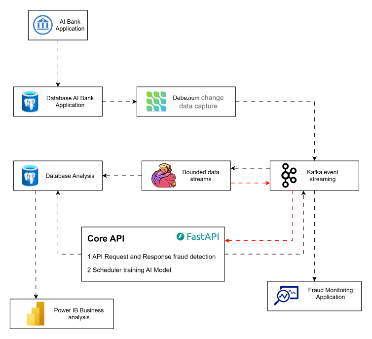

# 📘 Group 1
Members
* **Mr.Sat Rotana**
* **Mr.Khun Kimsal**
* **Mr.Pov Sokny**


# 🛡️ Real-Time Fraud Detection System

A high-performance, real-time banking fraud detection platform built as a comprehensive final capstone project.

This project demonstrates end-to-end expertise in:
* **Full-Stack Software Development**
* **Real-Time Data Streaming**
* **Distributed Message Brokers**
* **Change Data Capture (CDC)**
* **Apache Flink Stream Processing**
* **Machine Learning and Artificial Intelligence**
* **Data Analysis** (Excel, Power BI, SQL, Python, and R)

The system analyzes banking transactions in real time and detects suspicious behavior using both rule-based fraud detection and trained AI/ML models.

---



## 📊 Analytics & AI Core

The intelligent fraud detection engine is trained and evaluated against six critical real-world banking fraud scenarios.

### 🧠 Trained Fraud Scenarios

#### 1. Immediate Large Transfer After Account Creation
* **Pattern:** Normal users typically begin with small transactions or leave a newly created account inactive for some time. A massive transfer shortly after account creation can indicate a *Money Mule Account* — an account created or compromised specifically to receive and rapidly move stolen funds before the activity is detected.
* **Detection signals include:**
  * Very young account age
  * Extremely large transaction amount
  * Transaction occurring shortly after account creation
  * Abnormal transaction behavior compared to normal users

#### 2. Many-to-One Consolidation
* **Pattern:** Multiple accounts rapidly send money to a single receiving account. This pattern can indicate money laundering, layering, structuring, or coordinated mule-account activity. The receiving account acts as a central hub account, consolidating funds from many different senders before the money is withdrawn or transferred elsewhere.
* **Detection signals include:**
  * High number of unique senders
  * Many transactions to the same receiver
  * Rapid transaction activity
  * Increasing transaction volume over a short period

#### 3. Multiple Same-Amount Transactions
* **Pattern:** Repeated transactions with exactly the same amount within a short time window. Real-world human transaction behavior usually varies in both timing and amount. Repeated identical transactions can indicate automated bot activity, card testing, scripted attacks, or attempts to avoid transaction monitoring thresholds.
* **Detection signals include:**
  * Multiple identical transaction amounts
  * High frequency within a short time window
  * Repeated transactions involving the same account
  * Unusual patterns compared to the account's historical behavior

#### 4. Velocity Spikes
* **Pattern:** A large number of transactions are executed within an extremely short period. Attackers often attempt to move or disperse funds quickly before stolen credentials, cards, or accounts are frozen. This can be associated with account takeover, automated attacks, card fraud, rapid fund draining, or credential compromise.
* **Detection signals include:**
  * High transaction count within a short period
  * Large transaction volume within a short period
  * Sudden deviation from normal account behavior

#### 5. Drastic Geolocation Changes
* **Pattern:** A transaction occurs from one geographical location, followed shortly afterward by another transaction from a location that would be physically impossible to reach within the available time (e.g., a transaction in Cambodia, followed 10 minutes later by another from Europe). This may indicate Account Takeover (ATO), stolen credentials, proxy/VPN usage, compromised devices, or impossible-travel activity.
* **Detection signals include:**
  * Large geographic distance between transactions
  * Very short time difference
  * High calculated travel speed
  * Sudden IP or location changes

#### 6. Sleep-and-Wake Pattern
* **Pattern:** An account remains inactive for a long period and then suddenly becomes highly active.
  ```text
  Long period of inactivity
          ↓
  Account suddenly becomes active
          ↓
  Multiple high-value transactions
          ↓
  Activity stops again

```

This behavior can indicate dormant account takeover, reactivated mule accounts, coordinated fraud campaigns, or accounts being used only during specific laundering operations.

* **Detection signals include:**
* Long period since the previous transaction
* Sudden increase in transaction volume
* Multiple high-value transactions
* Burst activity within a short period
* Return to inactivity after the burst


---

## 🚀 System Architecture

The platform processes banking transactions through a real-time streaming pipeline:

```text
┌─────────────────┐
│   AIBank Web UI │
│   Next.js       │
└────────┬────────┘
         │
         ▼
┌─────────────────┐
│   PostgreSQL    │
│   AIBank DB     │
└────────┬────────┘
         │
         ▼
┌─────────────────┐
│    Debezium     │
│    CDC Engine   │
└────────┬────────┘
         │
         ▼
┌─────────────────┐
│      Kafka      │
│  Event Streaming│
└────────┬────────┘
         │
         ▼
┌─────────────────┐
│   Apache Flink  │
│ Fraud Detection │
└────────┬────────┘
         │
         ▼
┌──────────────────┐
│     Core API     │
│ Predection Fraud │
└────────┬─────────┘
         │
         ▼
┌─────────────────┐
│  Fraud Alerts   │
│  & AI Analysis  │
└─────────────────┘

```

---

## 🛠️ Infrastructure Components

| Service | URL | Purpose |
| --- | --- | --- |
| **AIBank Web UI** | `http://localhost:3000` | Banking simulator and frontend application |
| **Debezium Connect** | `http://localhost:8083` | Capture PostgreSQL changes and publish them to Kafka |
| **Kafka UI** | `http://localhost:8080` | Monitor Kafka clusters, topics, messages, and consumer activity |
| **Apache Flink** | `http://localhost:8081` | Stateful real-time stream processing and fraud detection |
| **Core API** | `http://127.0.0.1:8000/docs` | Backend to manage training AI/ML model and request, response predections fraud |

---

## 🚀 Step-by-Step Deployment Guide

### Phase 1: Start the Multi-Container Cluster

1. Make sure you are inside the project root directory:
```bash
cd AI-FINAL-PROJECT

```


2. Build the Docker images and start all services in detached mode:
```bash
docker compose up --build

```


> **Note:** The correct Docker Compose command is `docker compose up --build`.


3. Monitor the AIBank Application Logs:
To monitor the dataset generation and application startup process:
```bash
docker logs -f ai-bank-app

```


4. Wait until dataset generation is completed successfully.
**Expected output:**
```text
========================================
FINAL DATASET
========================================
Total: 1,000,000
Fraud: 300,000
Normal: 700,000
Fraud percentage: 30.00%
========================================

Final counts are correct.
Dataset generation completed successfully.

▲ Next.js 16.2.10
- Local:         http://localhost:3000
- Network:       http://localhost:3000

✓ Ready in 0ms

```


> ⏳ **Important:** The initial dataset generation may take some time. Wait until the application has finished generating the dataset and the required infrastructure services have successfully started.


---

### Phase 2: Establish the Change Data Capture Pipeline

Once the infrastructure is running, configure Debezium to capture changes from the PostgreSQL database.

**The CDC pipeline:**


$$\text{PostgreSQL} \longrightarrow \text{Debezium} \longrightarrow \text{Kafka} \longrightarrow \text{Apache Flink}$$

The following connectors capture changes from:

* `public.transactions`
* `public.bank_accounts`

You can create the connectors using cURL, Postman, Thunder Client, or any HTTP client.

#### 2.1 Create the Transactions Connector

* **Request:** `POST http://localhost:8083/connectors`
* **Headers:** `Content-Type: application/json`
* **Request Body:**
```json
{
  "name": "aibank-transactions",
  "config": {
    "connector.class": "io.debezium.connector.postgresql.PostgresConnector",
    "database.hostname": "postgres-aibank",
    "database.port": "5432",
    "database.user": "postgres",
    "database.password": "postgres",
    "database.dbname": "aibank",
    "topic.prefix": "aibank",
    "plugin.name": "pgoutput",
    "slot.name": "aibank_transactions_slot",
    "publication.name": "aibank_transactions_publication",
    "decimal.handling.mode": "double",
    "publication.autocreate.mode": "filtered",
    "table.include.list": "public.transactions",
    "snapshot.mode": "initial",
    "include.schema.changes": "false",
    "tombstones.on.delete": "false",
    "key.converter": "org.apache.kafka.connect.json.JsonConverter",
    "value.converter": "org.apache.kafka.connect.json.JsonConverter",
    "key.converter.schemas.enable": "false",
    "value.converter.schemas.enable": "false"
  }
}
```


#### 2.2 Create the Bank Accounts Connector

* **Request:** `POST http://localhost:8083/connectors`
* **Headers:** `Content-Type: application/json`
* **Request Body:**
```json
{
  "name": "aibank-bank-accounts",
  "config": {
    "connector.class": "io.debezium.connector.postgresql.PostgresConnector",
    "database.hostname": "postgres-aibank",
    "database.port": "5432",
    "database.user": "postgres",
    "database.password": "postgres",
    "database.dbname": "aibank",
    "topic.prefix": "aibank",
    "plugin.name": "pgoutput",
    "slot.name": "aibank_bank_accounts_slot",
    "publication.name": "aibank_bank_accounts_publication",
    "decimal.handling.mode": "double",
    "publication.autocreate.mode": "filtered",
    "table.include.list": "public.bank_accounts",
    "snapshot.mode": "initial",
    "include.schema.changes": "false",
    "tombstones.on.delete": "false",
    "key.converter": "org.apache.kafka.connect.json.JsonConverter",
    "value.converter": "org.apache.kafka.connect.json.JsonConverter",
    "key.converter.schemas.enable": "false",
    "value.converter.schemas.enable": "false"
  }
}
```


---

### Phase 3: Verify the Debezium Connectors

After creating the connectors, verify that they were registered correctly.

#### Check Connector Configuration

* **Transactions:** `GET http://localhost:8083/connectors/aibank-transactions/config`
* **Bank Accounts:** `GET http://localhost:8083/connectors/aibank-bank-accounts/config`

#### Check Connector Runtime Status

Configuration verification confirms that the connector exists, but the status endpoint is more useful for checking whether the connector is actually running.

* **Transactions:** `GET http://localhost:8083/connectors/aibank-transactions/status`
* **Bank Accounts:** `GET http://localhost:8083/connectors/aibank-bank-accounts/status`

A healthy connector should report:

```json
{
  "connector": {
    "state": "RUNNING"
  },
  "tasks": [
    {
      "state": "RUNNING"
    }
  ]
}

```

---

### Phase 4: Verify Kafka Topics

Debezium automatically creates Kafka topics based on the configured topic prefix. With `topic.prefix = aibank`, the generated topics will typically use the `aibank` prefix.

* Open the Kafka UI: `http://localhost:8080/ui/clusters/local/all-topics`

From the Kafka UI, you can inspect:

* Kafka topics and partitions
* Messages and offsets
* Consumer groups
* Producer and consumer activity

---

### Phase 5: Generate the Fraud Detection Dataset

The dataset generation process creates a large, labeled dataset containing both fraudulent and normal banking transactions used for model training, feature analysis, and visualization.

#### 5.1 Open the Dataset Generation Notebook

Open the training directory using Visual Studio Code:

```bash
code training_models/generate_dataset.ipynb

```

*(Ensure Visual Studio Code and the required Python/Jupyter extensions are installed.)*

#### 5.2 Generate the Dataset

Run the notebook to:

1. Read raw banking data from the AIBank PostgreSQL database.
2. Generate transaction features.
3. Apply the six fraud scenarios.
4. Label transactions as fraudulent or normal.
5. Insert the generated feature dataset into the analysis database.
6. Export the final dataset as a CSV file.

**Example dataset distribution:**

```text
========================================
FINAL DATASET
========================================
Total: 1,000,000
Fraud: 300,000
Normal: 700,000
Fraud Percentage: 30.00%
========================================

```

**Dataset Flow:**

```text
Raw Transaction Data ──► Feature Engineering ──► Fraud Scenario Generation
                                                        │
                                                        ▼
Machine Learning Training ◄── CSV Dataset ◄── Analysis Database ◄── Fraud/Normal Labels

```

---

## 🧠 Machine Learning Pipeline

The complete AI workflow follows this path:

$$\text{Transaction Data} \longrightarrow \text{Feature Engineering} \longrightarrow \text{Fraud Scenario Labeling} \longrightarrow \text{Dataset Generation}$$

$$\downarrow$$

$$\text{Real-Time Detection} \longleftarrow \text{Model Export} \longleftarrow \text{Evaluation} \longleftarrow \text{Training} \longleftarrow \text{EDA} \longleftarrow \text{Data Cleaning}$$

### Features Used by ML Model:

* Transaction amount & account age
* Receiver transaction count & unique sender count
* Repeated transaction amounts
* Sender transaction velocity & volume
* Time since previous transaction
* Geographic distance & estimated travel speed
* Dormancy duration

---

## ⚡ Real-Time Fraud Detection Flow

After dataset generation and model training, real-time transactions follow this streaming pipeline:

```text
New Banking Transaction
          ↓
PostgreSQL INSERT
          ↓
Debezium CDC Event
          ↓
Kafka Topic
          ↓
Apache Flink
          ↓
Feature Calculation
          ↓
Fraud Rules + AI Model
          ↓
Fraud Risk Score
          ↓
Fraud Alert / Action

```

### System Actions Upon Detection:

* Generate a fraud alert
* Assign a fraud risk score
* Block or hold suspicious transactions
* Notify the core banking system
* Store detection results & update monitoring dashboard

---

### 🚀 Direct Testing Model Via Core API

* **Request:** `POST http://127.0.0.1:8000/api/v1/predictions`
* **Headers:** `Content-Type: application/json`
* **Request Body:**

#### "fraud_type": "IMMEDIATE_LARGE_TRANSFER"
```json
{
  "transaction_id": "0f462714-5660-4e5d-b21e-c972f8ef7277",
  "sender_account_id": "0f462714-c972f8ef7277",
  "receiver_account_id": "c972f8ef7277-0f462714",
  "trans_amount": 1250000.00,
  "age_hours_open_acc": 2,
  "receiver_txn_count_last_3d": 0,
  "unique_senders_last_3d": 78,
  "multi_same_amt_count_2d": 0,
  "sender_txn_count_last_1h": 1,
  "sender_volume_last_1h": 1250000.00,
  "days_since_last_trans": 9999,
  "geo_speed_kmh": 0,
  "event_time": "string"
}
```
#### "fraud_type": "LOCATION_JUMP"
```json
{
    "transaction_id": "0f462714-5660-4e5d-b21e-c972f8ef7277",
    "sender_account_id": "0f462714-c972f8ef7277",
    "receiver_account_id": "c972f8ef7277-0f462714",
    "trans_amount": 50000.00,
    "age_hours_open_acc": 12,
    "receiver_txn_count_last_3d": 1,
    "unique_senders_last_3d": 50,
    "multi_same_amt_count_2d": 0,
    "sender_txn_count_last_1h": 8,
    "sender_volume_last_1h": 400000.00,
    "days_since_last_trans": 9999,
    "geo_speed_kmh": 900
}
```
#### Normal Transactions
```json
{
    "transaction_id": "0f462714-5660-4e5d-b21e-c972f8ef7277",
    "sender_account_id": "0f462714-c972f8ef7277",
    "receiver_account_id": "c972f8ef7277-0f462714",
    "trans_amount": 850.00,
    "age_hours_open_acc": 240,
    "receiver_txn_count_last_3d": 12,
    "unique_senders_last_3d": 4,
    "multi_same_amt_count_2d": 1,
    "sender_txn_count_last_1h": 4,
    "sender_volume_last_1h": 2400.00,
    "days_since_last_trans": 1,
    "geo_speed_kmh": 25
}
```

## 🎯 Project Objective

The objective of this project is to demonstrate how modern financial institutions can combine **full-stack application development**, **PostgreSQL databases**, **Change Data Capture**, **Apache Kafka**, **Apache Flink**, **Feature Engineering**, and **Machine Learning / Artificial Intelligence** with **real-time stream processing** to build an end-to-end real-time banking fraud detection platform.

The final system is designed to detect suspicious transaction behavior in real time, analyze complex fraud patterns, and provide immediate fraud intelligence before potentially fraudulent activity can cause significant financial damage.